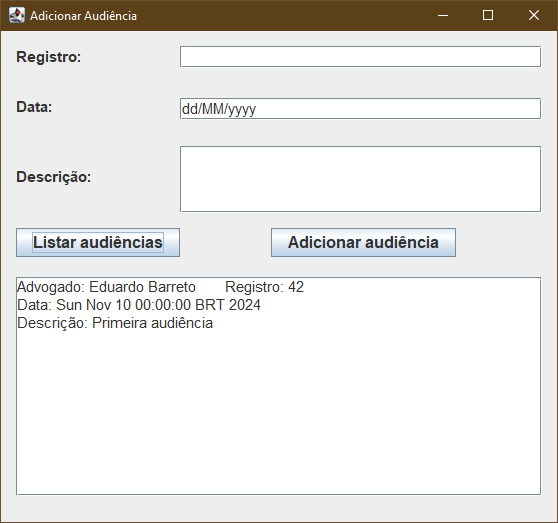
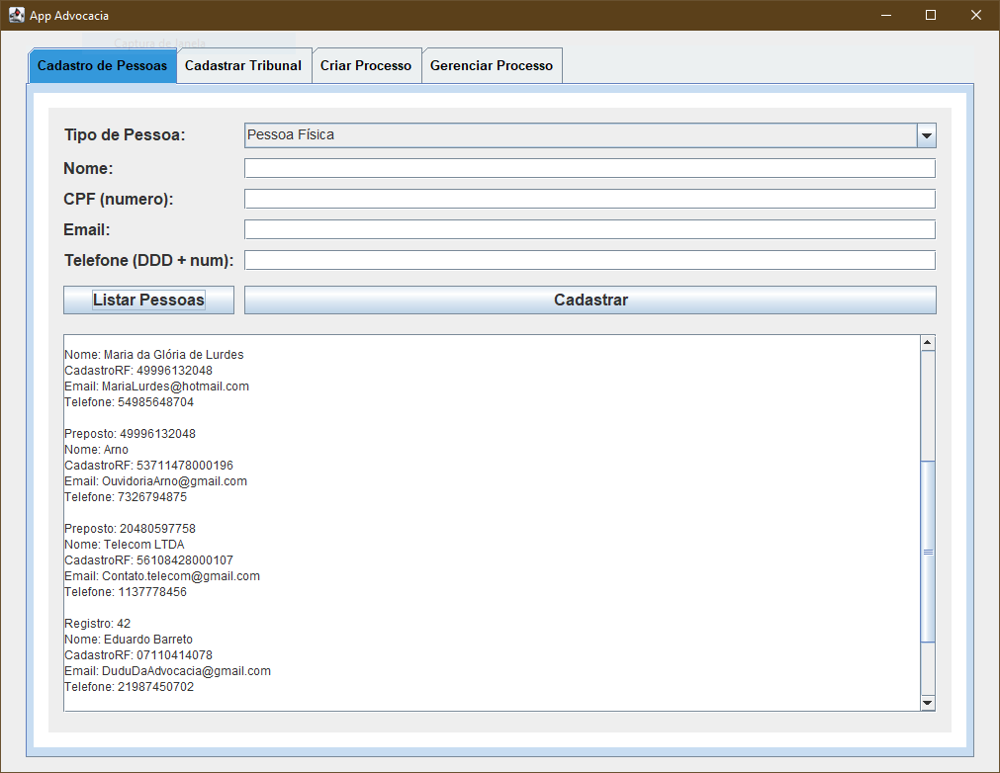
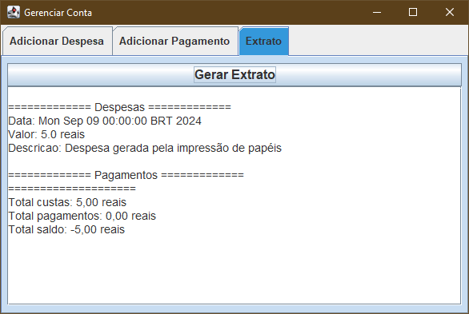
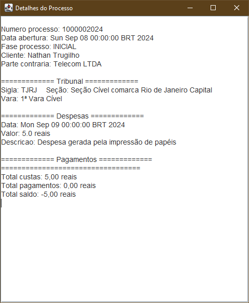
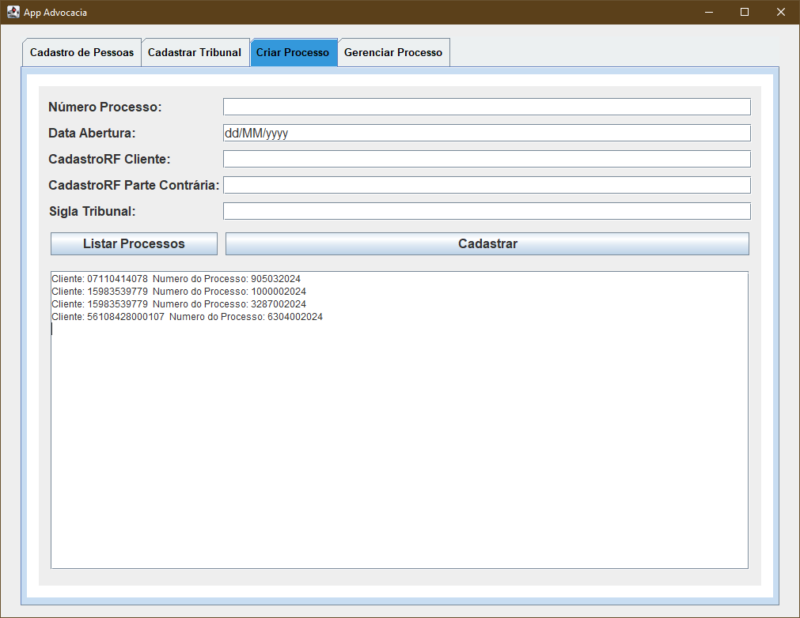
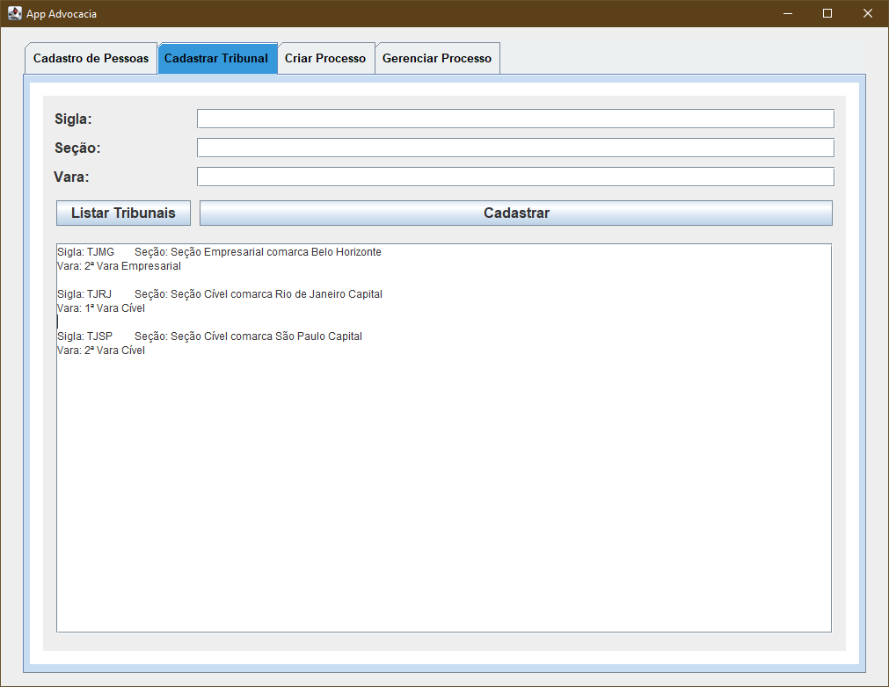
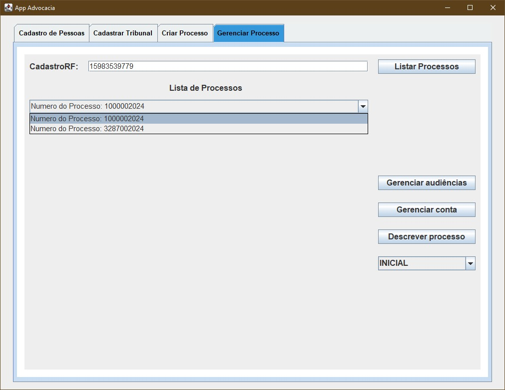

# Sistema de Gestão de Escritório de Advocacia  

Projeto desenvolvido como parte da disciplina **Programação Orientada a Objetos** no curso de Engenharia de Computação (CEFET-RJ).  

O enunciado completo em pdf está disponível [aqui](Enunciado.pdf)

## Objetivo
Automatizar o controle de processos de um escritório de advocacia, permitindo cadastro de clientes, processos, audiências e controle financeiro.  

## Tecnologias utilizadas
- **Java (Swing)** – Interface gráfica  
- **POO ** – Arquitetura em camadas (`model`, `view`, `controller`, `persistence`)  
- **Persistência em arquivo binário**  

## Funcionalidades
- Cadastro de **pessoas físicas e jurídicas**  
- Registro de **processos** (número, tribunal, cliente, parte contrária)  
- Gerenciamento de **audiências** (data, advogado responsável, recomendações)  
- Controle de **custas processuais e honorários**  
- Registro de **pagamentos de clientes** e acompanhamento de **saldo**  
- Interface gráfica com **menu principal e janelas dedicadas**  

---

## Imagens do sistema

